# Phase 1: Statistical Feature Analysis

## 1. Overview

NETRA (Network Threat Recognition & Analysis) uses the NSL-KDD dataset to develop a five-class network intrusion detection system.

The five attack classes used throughout the project are:

- `normal`
- `DoS`
- `Probe`
- `R2L`
- `U2R`

Phase 1 performs statistical analysis in R to establish which features should be retained, removed, or re-encoded before model development in Python.

The official `KDDTest+` dataset is reserved for final evaluation and is not used for feature-selection decisions or model training.

## 2. Dataset Quality

The dataset contains:

- **KDDTrain+:** 125,973 rows
- **KDDTest+:** 22,544 rows
- **Features:** 41
- **Columns including label and difficulty:** 43

Both datasets contain zero missing values and zero duplicate rows.

### Feature types

The datasets contain:

- 3 categorical network features:
  - `protocol_type`
  - `service`
  - `flag`
- 38 numeric/integer traffic features.

The training set contains 70 distinct service values, while the test set contains 64.

## 3. Five-Class Distribution

### Training set

| Class | Samples |
|---|---:|
| normal | 67,343 |
| DoS | 45,927 |
| Probe | 11,656 |
| R2L | 995 |
| U2R | 52 |

### Test set

| Class | Samples |
|---|---:|
| normal | 9,711 |
| DoS | 7,460 |
| Probe | 2,421 |
| R2L | 2,902 |
| U2R | 50 |

The class distribution is highly imbalanced, particularly for U2R and R2L in the training data.

Class imbalance is therefore treated as a modeling concern for Phase 2 rather than being addressed during this R analysis.

## 4. Categorical Feature Analysis

Chi-square tests were performed between each categorical feature and the five-class attack label.

| Feature | Chi-square | df | Cramér's V |
|---|---:|---:|---:|
| `protocol_type` | 25,578.38 | 8 | 0.3186272 |
| `service` | 156,818.89 | 276 | 0.5578667 |
| `flag` | 120,934.71 | 40 | 0.4898992 |

All three categorical features demonstrate substantial association with attack class.

The chi-square tests produced warnings about the approximation because of sparse contingency-table cells. The extremely small p-values were displayed as `0` by R due to numerical underflow; they should not be interpreted as literally equal to zero.

### Recommendation

- **KEEP:** `protocol_type`
- **KEEP:** `flag`
- **RE-ENCODE:** `service`

`service` has relatively high cardinality, so one-hot encoding would create a large sparse representation. Frequency encoding is therefore selected for the first Python implementation.

Frequency encoding also avoids introducing target information into the feature representation.

## 5. Continuous Feature Analysis

ANOVA and Kruskal-Wallis tests were performed across the five attack classes.

Most non-constant numeric features showed statistically significant differences between classes after Benjamini-Hochberg correction.

However, the large NSL-KDD training sample means statistical significance alone should not determine feature selection. Practical considerations such as redundancy, variance, domain meaning, and representation are also considered.

### Notable findings

- `duration`, `src_bytes`, and `dst_bytes` are strongly right-skewed/heavy-tailed.
- `count` and `srv_count` show substantial differences between attack classes.
- `same_srv_rate`, `serror_rate`, and `rerror_rate` provide useful class separation.
- Several destination-host error-rate variables are highly redundant.
- `num_compromised` and `num_root` are almost perfectly correlated.
- `num_outbound_cmds` has zero variance and contains no useful information.

`is_host_login` was not statistically significant after correction, but it is retained because statistical significance alone is not being used as an automatic feature-dropping rule.

## 6. Correlation Analysis

Features with absolute Pearson correlation greater than 0.85 were investigated.

Important redundant relationships included:

| Feature A | Feature B | |r| |
|---|---|---:|
| `num_compromised` | `num_root` | 0.9988335 |
| `serror_rate` | `srv_serror_rate` | 0.9932892 |
| `rerror_rate` | `srv_rerror_rate` | 0.9890077 |
| `srv_serror_rate` | `dst_host_srv_serror_rate` | 0.9862517 |
| `dst_host_serror_rate` | `dst_host_srv_serror_rate` | 0.9850522 |
| `srv_rerror_rate` | `dst_host_srv_rerror_rate` | 0.9702080 |
| `dst_host_srv_count` | `dst_host_same_srv_rate` | 0.8966635 |
| `hot` | `is_guest_login` | 0.8602881 |

These relationships form several correlated feature clusters rather than representing independent drop decisions.

## 7. Feature Recommendations

The following policy is the Phase 1 → Phase 2 handoff.

### 🔴 DROP

| Feature | Reason |
|---|---|
| `num_outbound_cmds` | Zero variance |
| `num_compromised` | Extremely redundant with `num_root` |
| `srv_serror_rate` | Highly redundant with error-rate cluster |
| `dst_host_serror_rate` | Highly redundant with error-rate cluster |
| `dst_host_srv_serror_rate` | Highly redundant with error-rate cluster |
| `srv_rerror_rate` | Highly redundant with error-rate cluster |
| `dst_host_rerror_rate` | Highly redundant with error-rate cluster |
| `dst_host_srv_rerror_rate` | Highly redundant with error-rate cluster |
| `dst_host_srv_count` | Highly correlated with `dst_host_same_srv_rate` |

### 🟡 RE-ENCODE

| Feature | Representation |
|---|---|
| `duration` | `log1p` transformation |
| `src_bytes` | `log1p` transformation |
| `dst_bytes` | `log1p` transformation |
| `service` | Frequency encoding |

### 🟢 KEEP

All remaining features are retained for the initial Python pipeline.

This includes:

- `protocol_type`
- `flag`
- `hot`
- `logged_in`
- `root_shell`
- `su_attempted`
- `num_root`
- `count`
- `srv_count`
- `serror_rate`
- `rerror_rate`
- `same_srv_rate`
- `diff_srv_rate`
- `srv_diff_host_rate`
- `dst_host_count`
- `dst_host_same_srv_rate`
- `dst_host_diff_srv_rate`
- `dst_host_same_src_port_rate`
- `dst_host_srv_diff_host_rate`

and the remaining non-dropped features.

## 8. Baseline Multinomial Model

A five-class multinomial logistic regression baseline was trained on KDDTrain+ using the original feature representation, excluding the constant `num_outbound_cmds`.

The baseline achieved:

**Training accuracy: 96.31429%**

This is a training baseline only and must not be interpreted as final model performance.

### Per-class metrics

| Class | Precision | Recall | F1 |
|---|---:|---:|---:|
| normal | 0.9723454 | 0.9700786 | 0.9712107 |
| DoS | 0.9809452 | 0.9662290 | 0.9735315 |
| Probe | 0.8898160 | 0.9332533 | 0.9110171 |
| R2L | 0.5830086 | 0.7517588 | 0.6567164 |
| U2R | 0 | 0 | 0 |

The baseline demonstrates strong aggregate training accuracy but exposes the class-imbalance problem: U2R is completely missed and R2L performance is substantially weaker than the majority classes.

## 9. Visualizations

The Phase 1 analysis produced the following figures:

```{r, echo=FALSE, out.width="90%"}
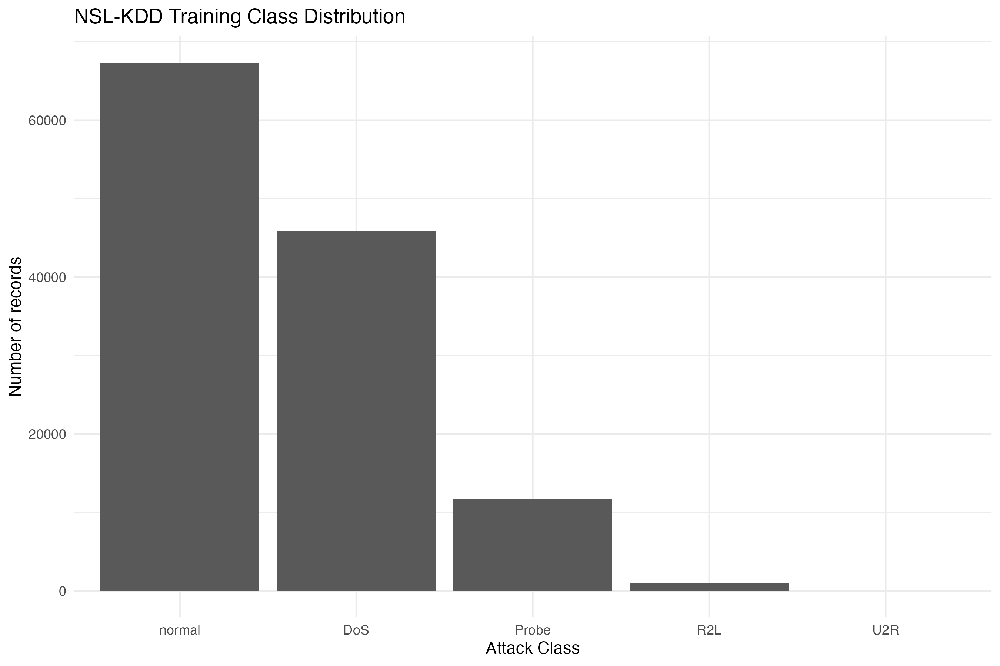
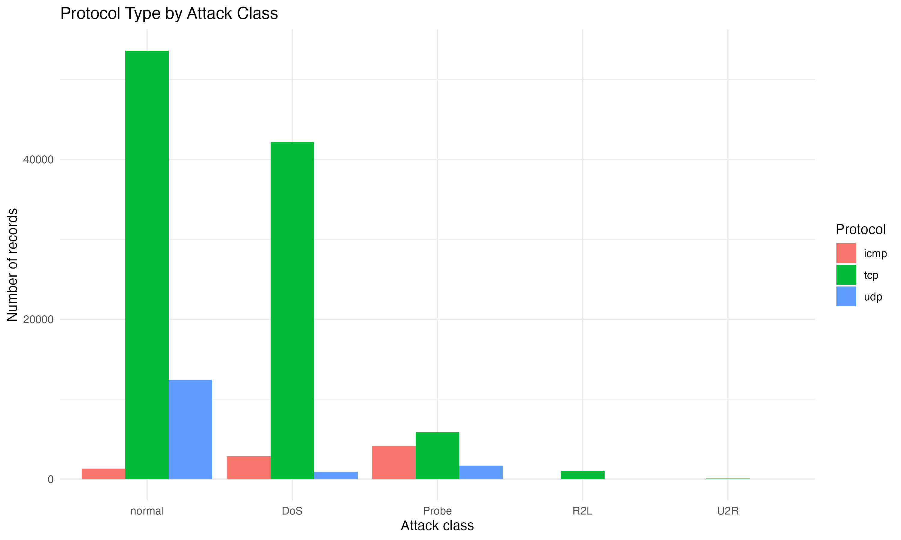
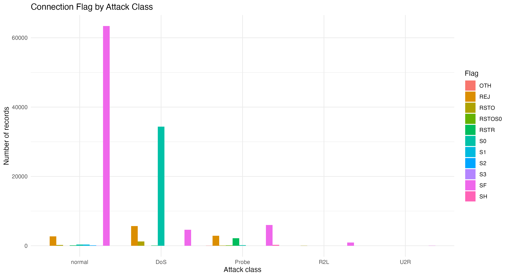
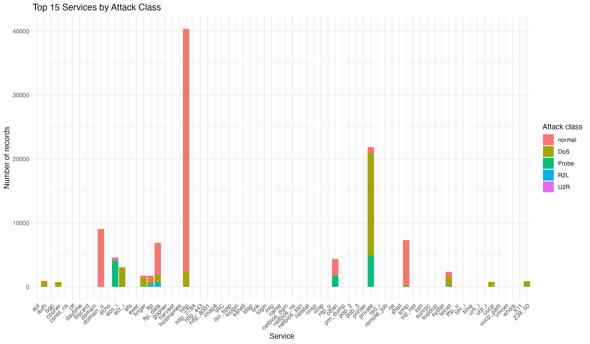
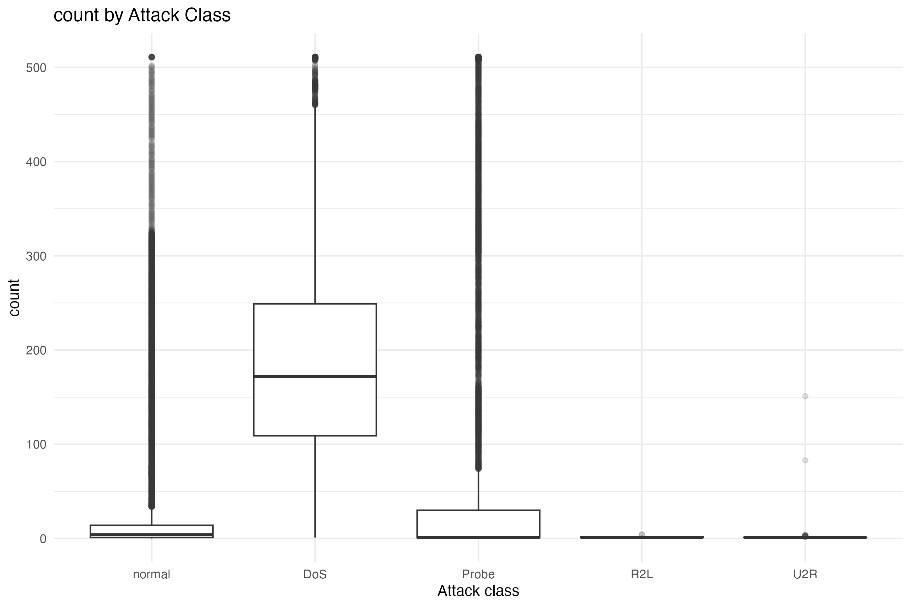
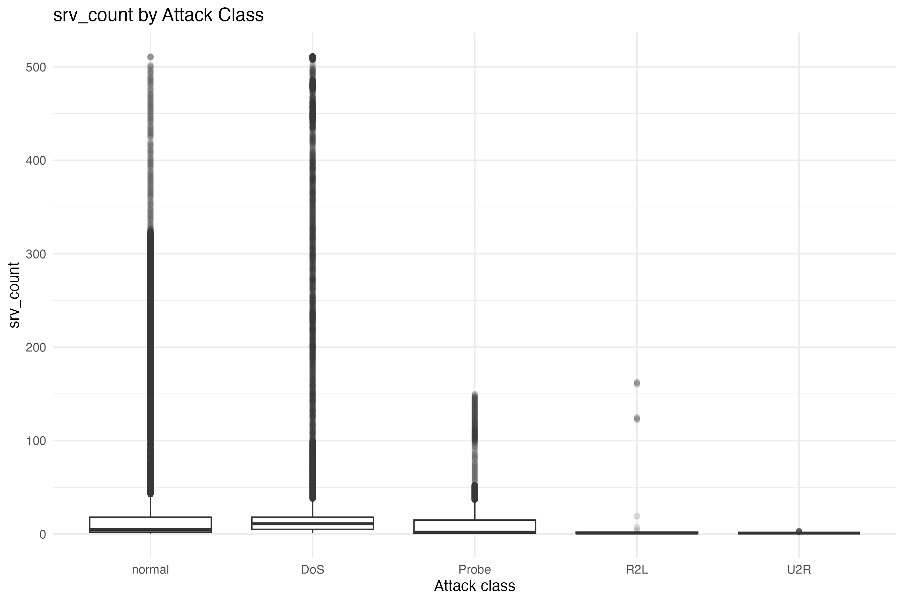
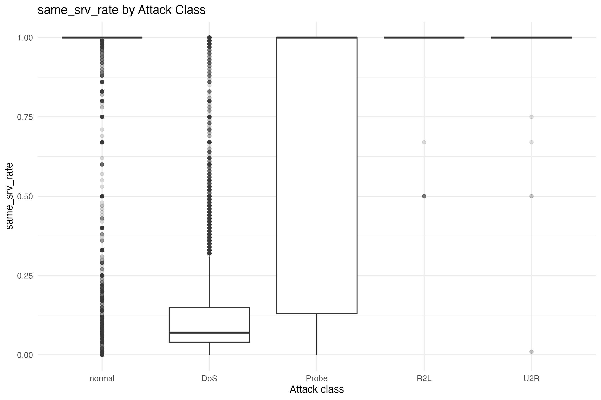
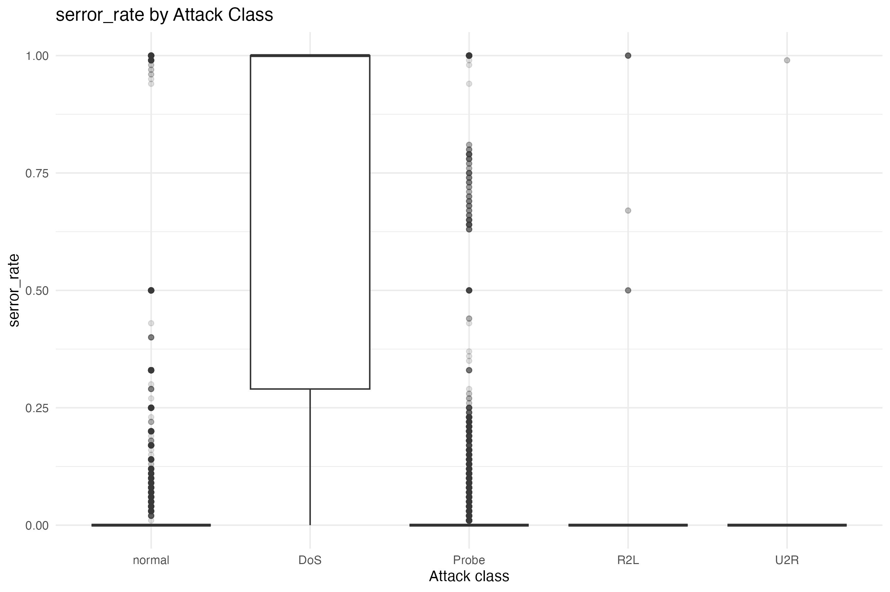
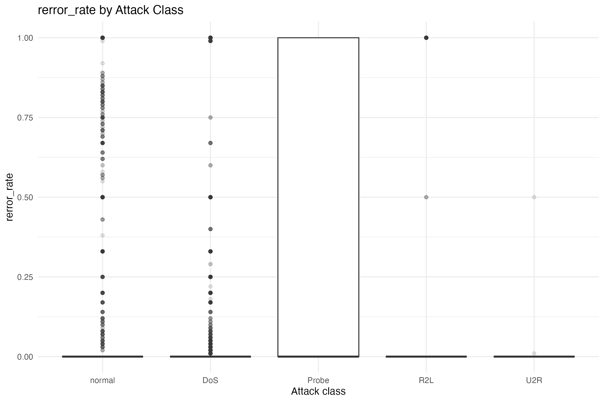
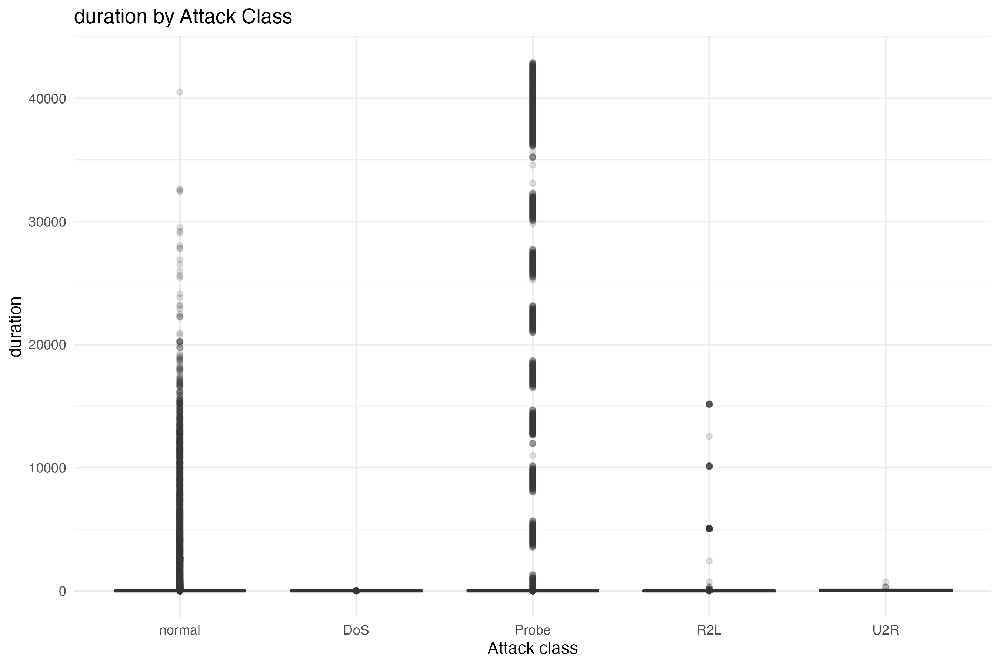
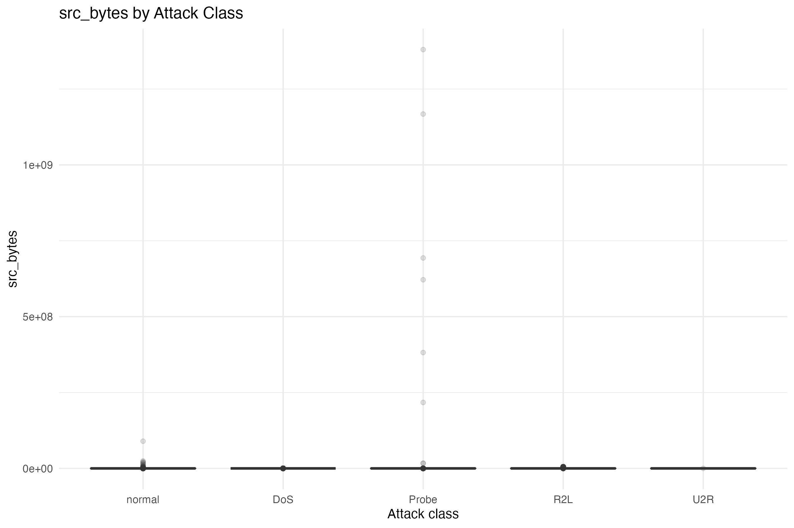
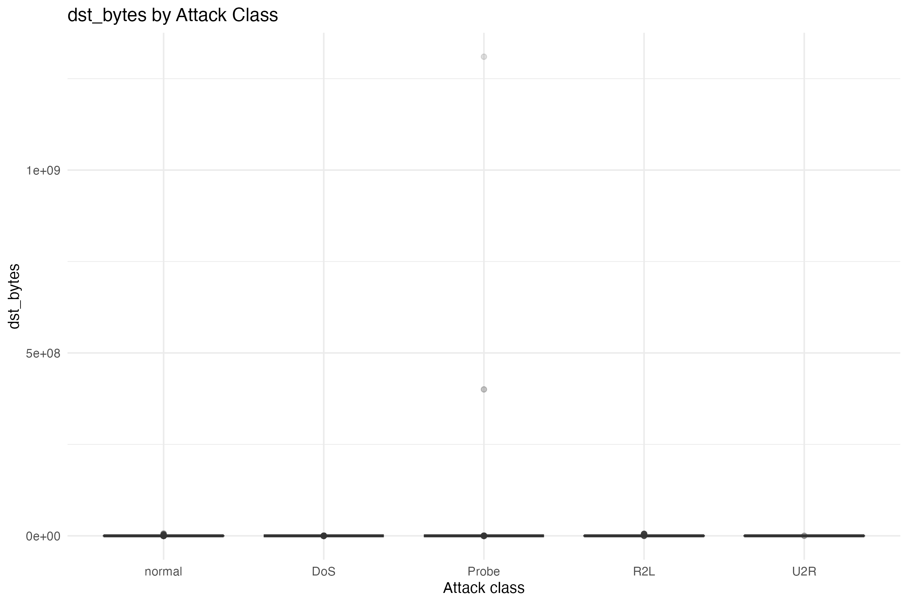
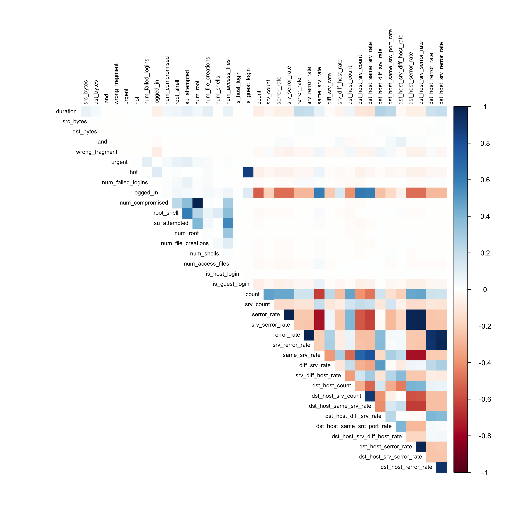